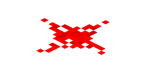

# Redstone Scripting Language

<p align="center">
  
</p>

Redstone is a custom scripting language inspired by Minecraft concepts. It reimagines common programming ideas using themed keywords while remaining a real, executable language with its own lexer, parser, AST, and runtime.

---

## Overview

The goal of Redstone is to serve both as a learning project for language design and as a practical scripting language. Familiar programming constructs are renamed to match a Minecraft-inspired theme, making the language playful while still technically grounded.

---

## Project Goals

* Explore programming language design and implementation
* Build a complete lexer-to-runtime pipeline
* Keep the language readable, themed, and easy to extend

---

## Language Keywords

| Redstone Keyword | Meaning                      |
| ---------------- | ---------------------------- |
| `item`           | Variable declaration (`var`) |
| `bedrock`        | Constant declaration         |
| `workbench`      | Function declaration         |
| `comparator`     | If Statement                 |
| `otherwise`      | Else statement               |
| `air`            | `null`                       |
| `on`             | `true`                       |
| `off`            | `false`                      |
| `cut`            | `break`                      |
| `pulse`          | `continue`                   |
| `craft`          | `return`                     |

Example:

```
bedrock MAX = 10
item count = 3
```

---

## Building the Project

This project is written in C# and built using the .NET SDK.

### Prerequisites

* .NET SDK (version 7 or newer recommended)
* A command-line environment (PowerShell, Bash, etc.)

### Build Instructions

From the root of the repository:

```
dotnet build
```

This will compile the Redstone interpreter and all supporting projects.

---

## Running Redstone

### Running a Redstone Script

#### Program Mode

```
dotnet run -- <path to your .rsd file>
```

Example Redstone script:
```
bedrock PI = 3.141592653589793

item radius = 5

workbench calcCircumference(r) {
    item result = 2 * PI * r
    chat(result)
}

chat("The circumferene of a circle with radius ", radius, "is:")
calcCircumference(radius)
```

>!!! Remember that in program mode, stand alone statements like `1+2` are not allowed. 

#### Interactive Mode
```
dotnet run 
```

Then run the script:
```
run <path to your .rsd file>
OR
<type directly into the repl>
```

Example Redstone script:

```
workbench add(a, b) {
  a + b
}

chat(add(2, 3))
// returns 5
```

---

## Redstone Language Guide

### Variables

You can declare variables with the `item` keyword. An important thing about the Redstone language is that there is no semicolon ';' to end a statement.

```
item foo = 5
```

### If Statements

The comparator is used for conditional logic.  
It checks a condition and runs code only if the condition is true.

```
comparator (power > 10) {
    print("Powered")
}
```

### While Loops
The Repeater is used for looping.
It repeatedly runs code as long as the condition stays true.
```
repeater (power > 0) {
    power = power - 1
}
```

### For Loop

The Hopper is used to repeat a block of code a specific number of times.

```
hopper (item n = 0, n < maxCount, n = n + 1) {
    chat(n)
}
```

### Booleans and Boolean Operations
On/off represents the true and false values. 

Basic boolean operations are supported as well.

```
item truthy = on
item falsey = off

item isTruthy = truthy == falsey
```

### Object Creation

In Redstone, objects must be created using a block format.

```
item object = {
    foo: 54,
    bar: object2
}
```

#### Design Rule
Object definitions must be written across multiple lines.
The opening { starts the object.
Each property goes on its own line.
The closing } must be on a new line, not on the same line as any property.
This rule keeps object definitions easy to read and avoids confusing one-line objects.


### Native Functions

Redstone includes built-in native functions implemented in C#. These are currently focused on math utilities.

```
abs(0 - 5)
min(0,1)
max(100,10)
```

You can also print to the console with this:
```
chat("Hello World")
```

Additional native functions will be added over time.
